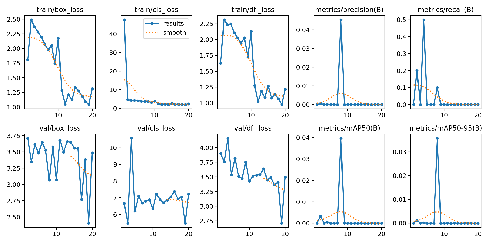
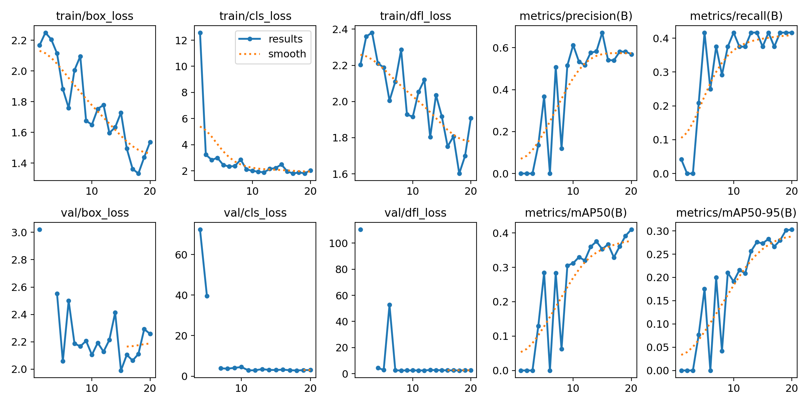
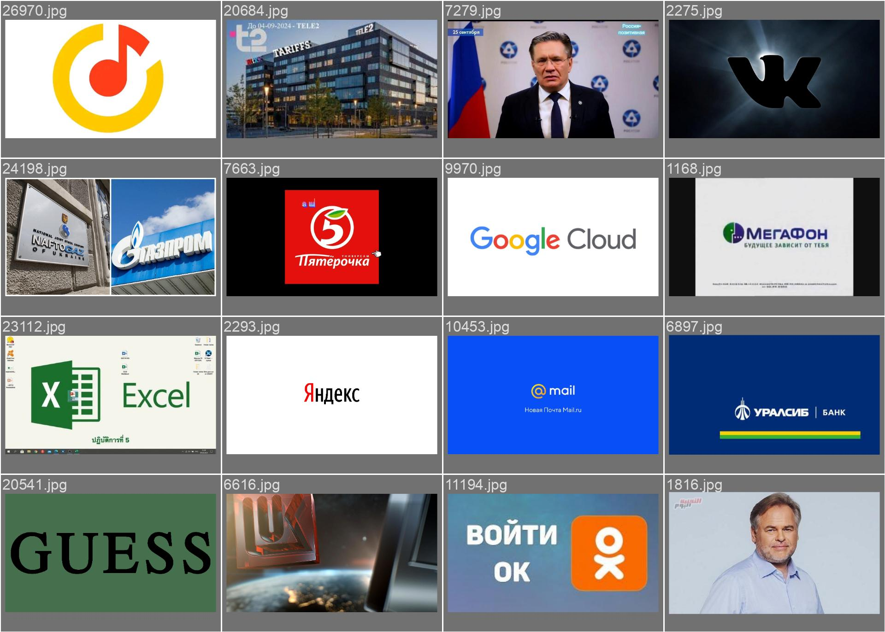

# Sirius x TBank Computer Vision Case

Этот репозиторий содержит решение на кейс для отбора в смену по ML от Т-Банка и Сириуса

## Подробное описание подхода к решению

Перед тем как приступить к решению, я наметил примерную стратегию
1. Предобработать датасет, найти способ разметить данные
2. Сделать базовый сервис для детекции логотипов с помощью способа разметки данных
3. На размеченных данных сделать Fine-tune YOLOv11, прикрутить ее к сервису


Первым делом, я просмотрел глазами датасет: он состоял из обычных изображений и из большего количество логотипов различных компаний.

Далее, я начал изучить, как можно автоматически размечать датасет для задачи детекции. 


В процессе поиска возможных решений, я наткнулся на один из методов: использовать SIFT + RANSAC. Тем более, для этого метода был готовый туториал от библиотеки OpenCV. Протестировав пару изображений, я решил остановиться на этом методе. 

Далее я начал реализовывать функции и готовить ноутбук, который можно было бы послать на Kaggle прогоняться и аннотировать датасет. Также, на каждом изображении я проверял, есть ли там логотип Тинькоффа или название "Тинькофф", и если есть, то не возвращал баундинг бокса логотипа, даже если они были. Эту версию ноутбука я отправил процесситься на Kaggle. 

Пока у меня запускался ноутбук на Kaggle, я создал базовый сервис на FastAPI, чтобы получать предикты по изображению. Здесь, для детекции логотипа использовался метод для аннотации. Также, я разработал базовый интерфейс на основе Streamlit.

Однако, я получил неприемлимо низкий Recall - изображения даже с явным логотипом не аннотировались. С полученным размеченным датасетом я попытался натренировать YOLO (yolo11m), однако, модель не обучилась совсем, поэтому я начал искать способы улучшить датасет




Я начал пробовать повышать Recall - первым делом, я убрал проверку на логотипы тинькоффа. Как я понимаю, логотип Тинькоффа имел в себе стилизованную Т как в логотипе Т-Банка, из-за чего даже обычные логотипы Т-Банка были реджектнуты. Также, на протяжении всего процесса у меня были параметры еще с туториала по OpenCV, в котором, так-то, стояла довольно другая задача. Следовательно, я начал играться с параметрами, чтобы повышать Recall;

В итоге, визуально я ощущал, что метод начал намного чаще детектировать логотип, однако он также детектировал различный шум. Однако, этот шум было легко обнаружить - его баундинг бокс был просто линией. Следовательно я добавил проверку на площадь баундинг бокса, перед тем как выдавать координаты. Таким образом, я смог повысить Recall, при этом убирая различный шум.

С новым методом я запустил процесситься на Kaggle 2000 изображений из датасета. Здесь уже было заметно, как метод довольно хорошо аннотировал данные, однако он все еще мог посчитать какой-нибудь фон или шум как за логотип Т-Банка. На полученном размеченном датасете я уже начал обучать YOLO. Параметры обучения были такие:
```python
results = model.train(
    data='/kaggle/working/data.yaml',
    epochs=20,
    batch=64,
    device=[0, 1],
    freeze=8,
    lr0=3e-3,
    augment=True,
    lrf=0.1
)
```

Эта модель уже добилась намного лучших результатов. 



Метрики кажутся не такими хорошими, однако, нужно учитывать, что показатели занижены, так как по факту разметка датасета все еще была некачественная. 

Можно посмотреть на пример одного батча:



Видно, что YOLO не предиктила шум; 
Ниже в README будут метрики на тестовом сете и примеры детекции


Kaggle-ноутбуки доступны здесь (со всеми версиями):

1. Ноутбук для автоматической разметки: https://www.kaggle.com/code/bulatsharipov1/sirius-tbank-annotate-dataset/notebook
2. Ноутбук для обучения YOLO: https://www.kaggle.com/code/bulatsharipov1/sirius-tbank-train-yolo

## Описание процесса работы с данными в процессе подготовки к решению

Для того чтобы протестировать модель, я подготовил test set: Я полез в Google искать различные изображения, связанные с Т-Банком, и другие несвязанные изображения. После того как я скачал картинки, я разметил их с помощью X-AnyLabeling; Набор доступен в папке ```test_set```. 


## Инструкции по запуску и использованию

1. Quick Test (no Compose)
```bash
docker build -t fastapi-svc:latest .
docker run --rm -p 8000:8000 --env-file .env fastapi-svc:latest
```

2. Compose (prod-like)
```bash
cp .env.example .env
docker compose up --build
```

3. Dev (auto-reload)
```bash
docker compose -f compose.dev.yaml up --build
```

4. Streamlit Showcase
```bash
pip install -r requirements.txt
streamlit run streamlit_app.py
```

## Результаты работы модели на валидационной выборке 

Ниже будут метрики модели на тестовым сете (Можно посмотреть больше результатов в папке notebooks и notebooks/runs)
```
metrics/precision(B): 0.9326854956255276
metrics/recall(B): 0.8421052631578947
metrics/mAP50(B): 0.8826712429727135
metrics/mAP50-95(B): 0.519325435244222
fitness: 0.519325435244222
```

Пример предиктов:


## Дополнительно - комментарии к решению

### Альтернативые подходы к решению

Некоторые идеи для автоматической аннотации, над которыми я думал
- Использовать SAM, чтобы сегментировать все, что можно на изображении, а потом проверять каждый сегмент на сходство с логотипом Т-банка; 
    - Минусы подхода: SAM скорее всего будет сегментировать не то, что мне нужно (допустим, он может выделить букву T в логотипе); Проверка всех сегментов изображения на сходство может тратить слишком много времени; Непонятно как можно уверенно проверять сходство между двумя изображениями; Нужно также учитывать, что мне придется отсеивать изображения, где логотипа нет, а следовательно подбирать какой-то трешхолд; Ну и наконец: SAM использует слишком много времени на инференс (даже FastSAM и MobileSAM работали неприемлимо дорого), и обрабатывать весь датасет было бы слишком долго
- Делать что-то по типу template matching-а. Можно брать и проходится логотипом по всему изображению, и проверять на сходство
    - Минусы подхода: этот метод не учитывает, что у нас могут быть ротации, разные скейлы, и цвет. Также несовсем понятно как уверенно можно считать сходство, и опять же, скорее всего придется подбирать трешхолд. Наконец, казалось, что такой метод не будет точным, исходя из предыдущего опыта
- Разметить самостоятельно достаточно изображений, чтобы зафайнтюнить YOLO, а потом итеративно использовать саму модель для улучшения датасета, и потом заново обучать
    - Минусы подхода: Этот метод кажется самым адекватным, однако я хотел попробовать использовать методы автоматический разметки для этого задания.


### Анализ текущих проблем решения и возможные улучшения

- На данный момент, я использовал только подмножество всех изображений из датасета. При наличии большего количества времени, можно запроцессить абсолютно все изображения в исходном наборе данных, и на них обучить YOLO. Это бы скорее всего дало бы лучшее результаты

- Модель YOLO все еще может пропускать логотипы, либо быть не слишком уверенной в ответе. Для этого можно итеративно улучшать датасет - размечать с помощью YOLO, прибегать к дополнительным методам, и потом заново дообучать

- Я использовал данные только из готового источника. На самом деле, можно было бы спарсить и использовать больше данных. Тем более, можно было бы генерировать синтетические данные - просто размечать логотип Т-банка где нибудь, применять какие-нибудь трансформации, чтобы не делать задачу тривиальной, и таким образом обогащать набор данных 

- SIFT + RANSAC все еще плохо аннотировал датасет, хотя и имел хороший Recall. Можно было бы поиграться с параметрами, или думать, как можно докрутить метод, чтобы размечать более качественно.


### Анализ производительности решения и предложение вариантов по его ускорению

На данный момент, решение довольно эффективно в плане производительности - на MacBook M3 Pro обработка одного изображения занимает ≈ 0,1 секунду

Возможные оптимизации
- Использовать ONNX, чтобы перевести модель в промежуточное состояние, и далее с помощью встроенных оптимизаций проводить инференс модели
- Задача довольно легкая: можно попробовать использовать более маленькую модель YOLO (например, ```yolo11n, yolo11s```)


